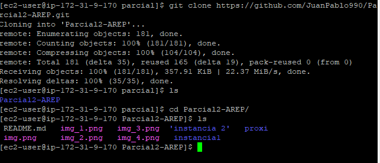
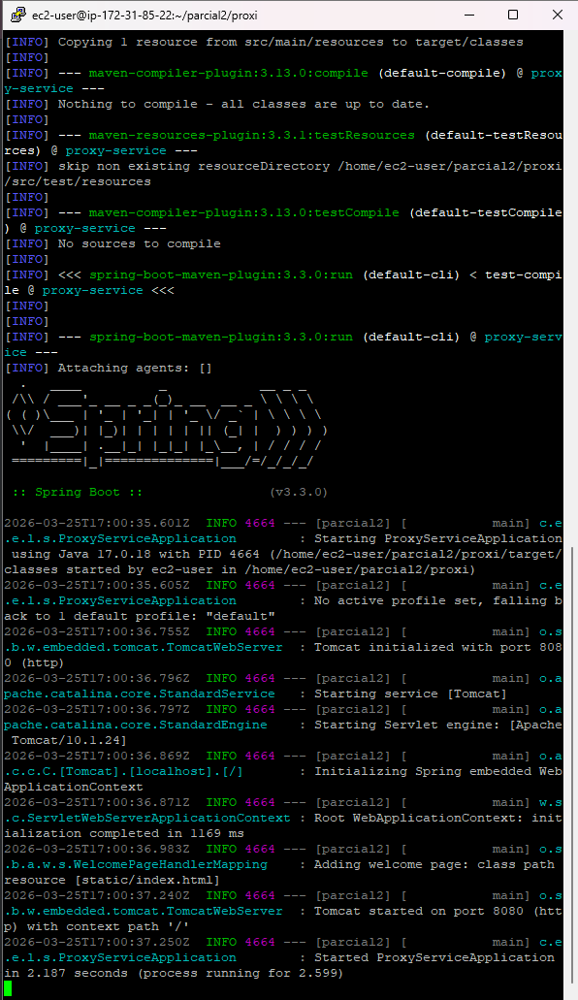
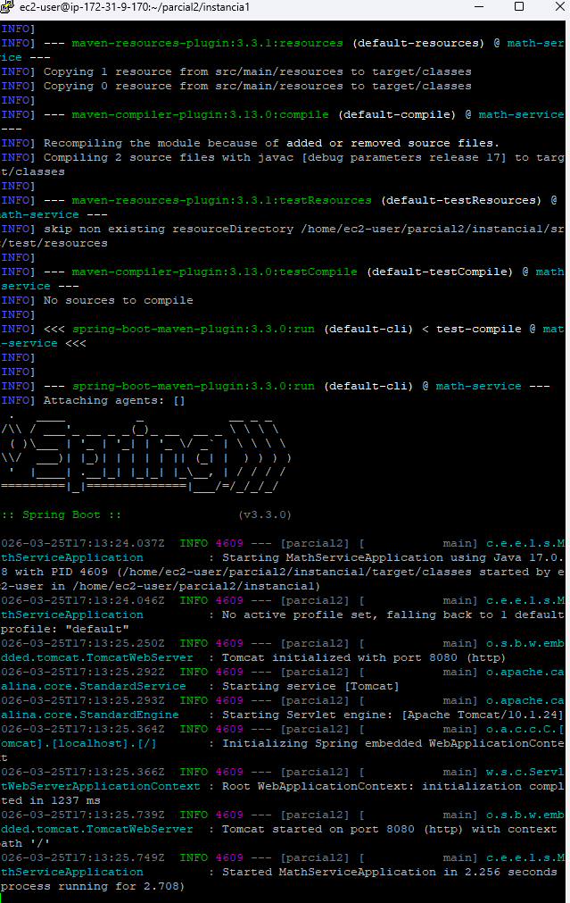
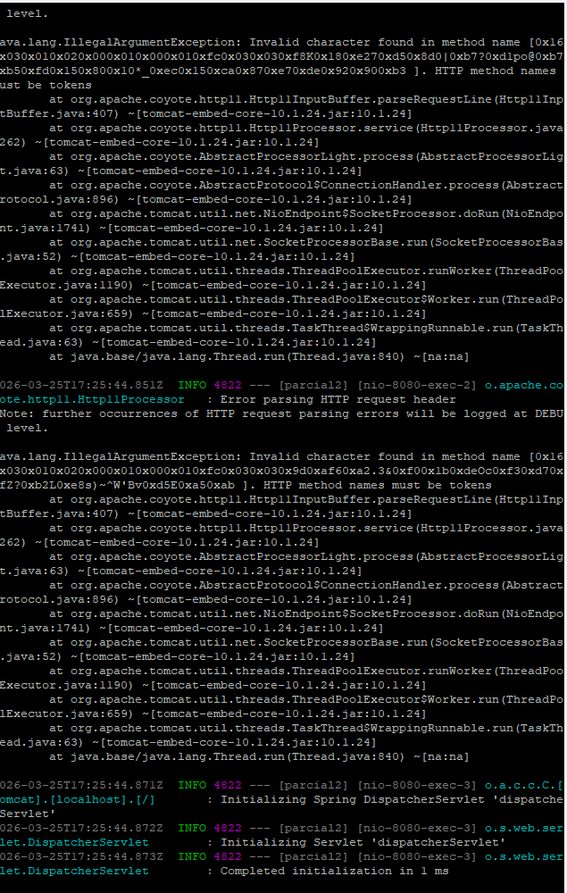
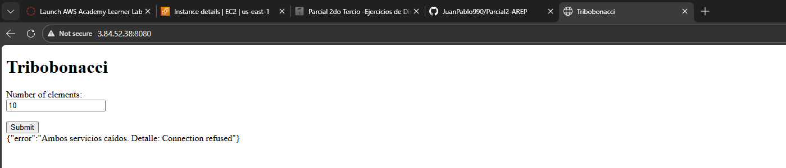

# Juan Pablo Nieto Cortes
# Parcial2-AREP

# 1. Ejercicio Propuesto

## Secuencia de Tribonacci

Sus servicios matemáticos deben incluir una función.

Una para calcular la secuencia de Tribonacci hasta un índice dado: tribseq(n) retorna un JSON con los términos desde

T(0) hasta T(n). (Recibe solo enteros no negativos).

Definición

T
(
0
)
=
0
,
T
(
1
)
=
0
,
T
(
2
)
=
1
,
T
(
n
)
=
T
(
n
−
1
)
,
T
(
n
−
2
)
,
T
(
n
−
3
)

para

n
≥
3

Implementación requerida
Implemente la secuencia en forma iterativa usando la recurrencia, acumulando cada término desde 0 hasta n. No use funciones de librerías ni APIs que ya entreguen la secuencia.

Detalles adicionales de la arquitectura y del API
Implemente el servicio para responder al método HTTP GET. Use el nombre de la función especificado y pase el parámetro en la variable de query con nombre "value".

Ejemplo de llamado (EC2)

https://amazonxxx.x.xxx.x.xxx:{port}/tribseq?value=13

Salida (JSON)

{
"operation": "Secuencia de Tribonacci",
"input": 13,
"output": "0, 0, 1, 1, 2, 4, 7, 13, 24, 44, 81, 149, 274, 504"

# 2. Primeros pasos

1. creamos las instancias

### Proxi


### instancia 1


### instancia 2


2. abrimos primero que todo los puertos para no tener conflictos con el firewall


3. se instala lo necesario que seria git, mvn y java 17 en las 3 instancias


# 2. Clonar en las maquinas EC2 el REPO



# 2. correr la instancia en EC2

## Ejecución 

1. **Instancia 1 (Math Service):**
   ```
   cd instancia1
   mvn spring-boot:run -Dspring-boot.run.arguments="--server.port=8081"
   ```

2. **Instancia 2 (Math Service):**
   ```
   cd instancia2
   mvn spring-boot:run -Dspring-boot.run.arguments="--server.port=8082"
   ```

3. **Proxy:**
   ```
   cd proxi
   export MATH_SERVICE_A_URL=http://localhost:8081
   export MATH_SERVICE_B_URL=http://localhost:8082
   mvn spring-boot:run
   ```


## proxi



## instancia 1



## instancia 2




## cuando los dos servers estan caidos


## video
https://pruebacorreoescuelaingeduco-my.sharepoint.com/:v:/g/personal/juan_nieto-co_mail_escuelaing_edu_co/IQCo60igE_CkTJLTxdFe52FBAfmVjgOe9wrfNS15jeRqXgA?nav=eyJyZWZlcnJhbEluZm8iOnsicmVmZXJyYWxBcHAiOiJPbmVEcml2ZUZvckJ1c2luZXNzIiwicmVmZXJyYWxBcHBQbGF0Zm9ybSI6IldlYiIsInJlZmVycmFsTW9kZSI6InZpZXciLCJyZWZlcnJhbFZpZXciOiJNeUZpbGVzTGlua0NvcHkifX0&e=tHwrwy
